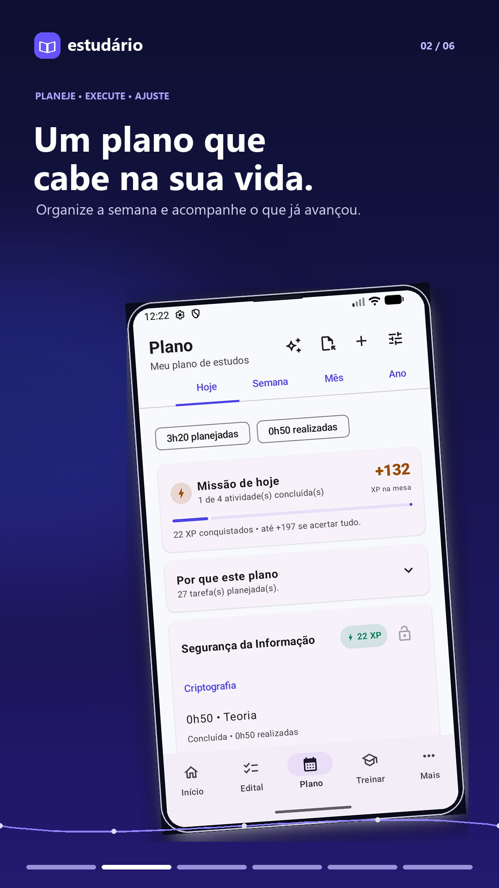
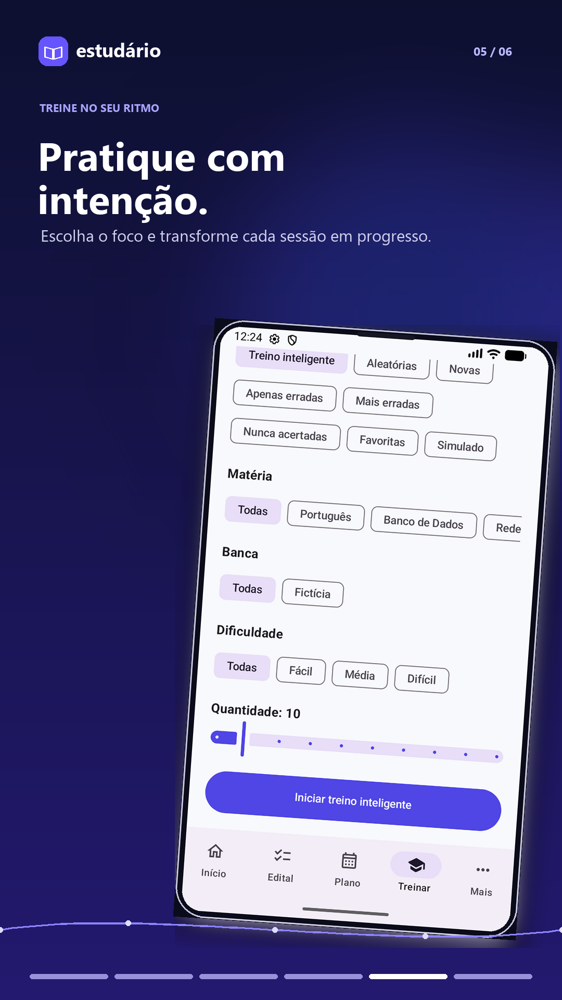

# Estudário

> Plataforma Android offline-first para transformar editais em planos de estudo executáveis.

[](https://github.com/OtavioClemente-bit/Estudario/actions/workflows/android.yml)


## Produto em execução

Capturas reais do aplicativo rodando em emulador Android a partir do APK do
projeto.


| Tela 1 | Tela 2 |
| --- | --- |
|  |  |

| Tela 3 | Tela 4 |
| --- | --- |
|  |  |

| Tela 5 | Tela 6 |
| --- | --- |
|  |  |

As capturas usam exclusivamente o conjunto de dados demonstrativos do próprio
aplicativo: concurso, plano, matérias e questões fictícias, sem dados pessoais.

O Estudário reúne edital, teoria, questões, revisões espaçadas, caderno de
erros e planejamento adaptativo em uma experiência local-first. O objetivo é
diminuir a distância entre saber o que estudar e executar uma rotina que se
adapta ao histórico real.

## Principais recursos

- Plano adaptativo com visões Hoje, Semana, Mês e Ano.
- Vários planos por concurso, com plano ativo e Plano Mestre.
- Motor determinístico que preserva sessões concluídas durante o replanejamento.
- Teoria em Markdown, livros, capítulos, resumos e marcações.
- Banco de questões, tentativas imutáveis e caderno de erros.
- Revisões espaçadas com ciclos configuráveis, incluindo D+1, D+7 e D+30.
- Importação e exportação dos formatos `.estudo` e `.plano`.
- Backup local validado, sem login obrigatório, anúncios ou backend em tempo de execução.

## Fluxo do produto

```text
Edital → Plano → Estudo → Questões → Revisão → Replanejamento
```

O planejamento e a execução usam modelos separados. Assim, uma sessão parcial
gera apenas o tempo restante e uma mudança de estratégia não apaga o histórico.

## Arquitetura

```text
UI Compose / Navigation
        ↓
ViewModels e repositórios
        ↓
Room / DataStore / WorkManager
        ↘
Motor de planejamento puro e determinístico
```

## Tecnologias

- Kotlin 2.4.20 e Java 17
- Jetpack Compose (BOM 2026.09.00) e Material 3
- Room 2.8.5/SQLite, Flow, ViewModel e coroutines 1.11.0
- DataStore Preferences 1.2.1
- WorkManager 2.12.0 e notificações nativas
- Gradle 8.14.5 / Android Gradle Plugin 8.13.2
- `compileSdk`/`targetSdk` 36 e `minSdk` 26
- CI no GitHub Actions com lint, testes unitários e build de debug a cada push/PR

## Executar localmente

Abra a raiz no Android Studio com JDK 17, sincronize o Gradle e execute em um
dispositivo ou emulador Android 8.0+.

```bash
./gradlew testDebugUnitTest assembleDebug
```

O APK de desenvolvimento é gerado em `app/build/outputs/apk/debug/app-debug.apk`.

## Documentação

- [Formato de estudos](docs/ESTUDO_FORMAT.md)
- [Formato de planos](docs/PLANO_FORMAT.md)
- [Regras de pontuação](docs/DOMAIN_SCORE.md)
- [Prompts para gerar estudos](docs/PROMPT_GERAR_ESTUDO.md)
- [Exemplos importáveis](examples/)

## Status

Projeto em evolução ativa, com foco em planejamento adaptativo, acessibilidade,
simulados e sincronização opt-in no futuro.

## Licença

Projeto privado. Consulte o autor antes de reutilizar código, marca ou assets.
